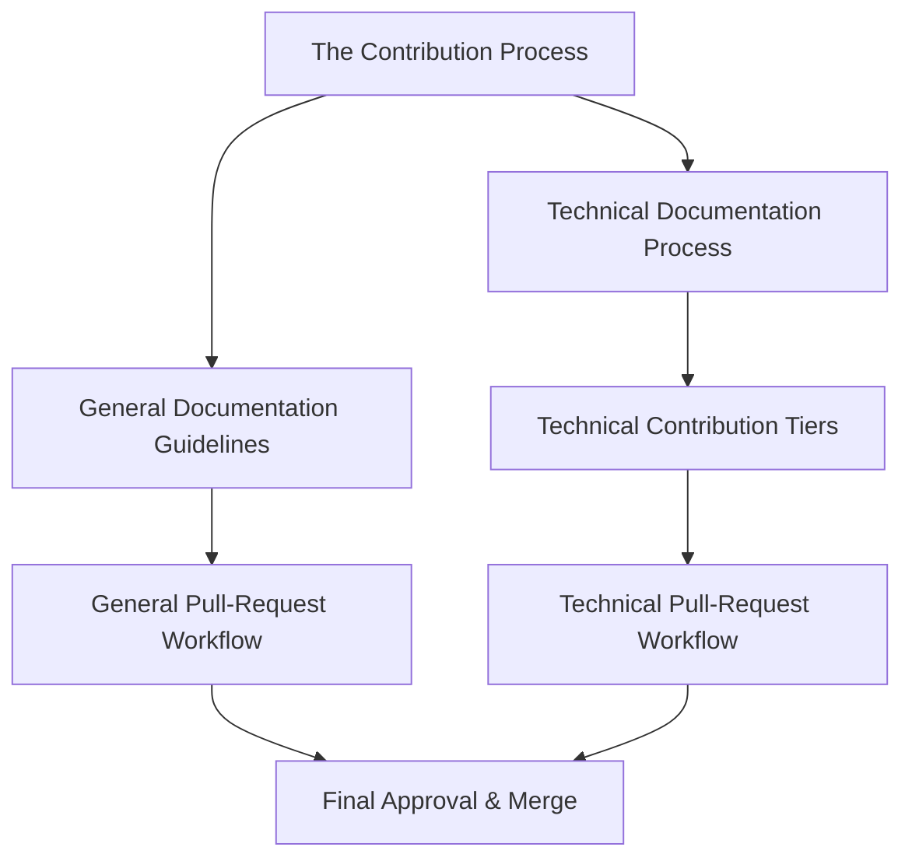
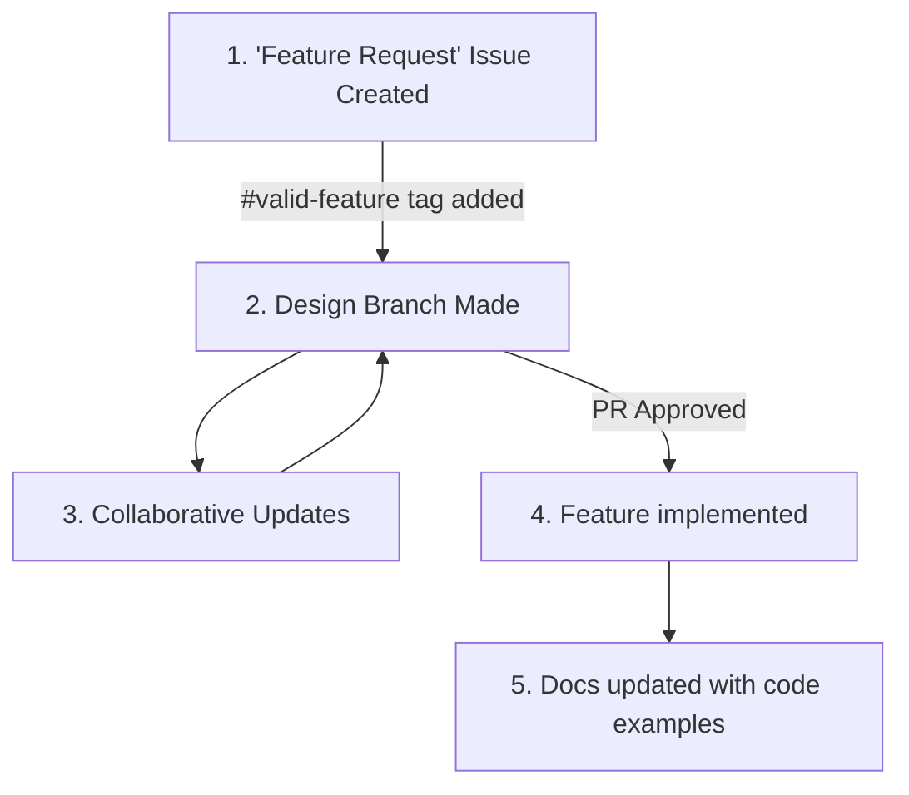

# The Contribution Process Overview
## Change Starts with Documentation
At EthicalMatch, every new idea begins with documentation. Why?
1. Documentation will *always* reflect the current state of the project
1. Clearly defined ideas make implementation smoother for developers
1. It gives autonomy to participants to learn and work at their own pace

## Use Issues to Propose Changes
All contributions start with an issue. This provides an avenue for conversation about your idea before any changes are made, and enables tracking of progress and prioritizing the interests of the community.  
The two issue templates you can open are:
- **[Documentation Change](https://github.com/Ethical-Commons-Project/EthicalMatch-docs/issues/new?assignees=&labels=enhancement&projects=&template=documentation-change.md&title=)**: For updates, clarifications, or new resources in the repository
- **[Feature Request](https://github.com/Ethical-Commons-Project/EthicalMatch-docs/issues/new?assignees=&labels=feature&projects=&template=feature_request.md&title=)**: For new functionality or significant changes requiring technical implementation

## Pull-Request Reviews and Approvals
Before merging changes, pull requests (PRs) undergo a review process to ensure quality, alignment with project goals, and adherence to our standards.
- **General Contributions** require approval from an authorized [area expert](https://github.com/Ethical-Commons-Project/EthicalMatch-docs/issues/8)
- **Technical Contributions** require approval from developers and peer reviewers

> [!Tip]
> If you're unfamiliar with how to make a pull request, our [first timers](#first-time-contributing-to-open-source) section will get you up to speed!

# Technical Documentation Process
## Documentation First?!
You may hear "documentation-first" and shudder, recalling the rigidity of [TDD](https://en.wikipedia.org/wiki/Test-driven_development) or the seemingly redundant drudgery of documenting existing code. With EthicalMatch, we’ve designed our documentation process to be the opposite:  
- **It reduces your design workload.** By collaborating on plain-English documentation to start, we give you a roadmap without locking you into rigid implementation details.
- **It simplifies post-implementation documentation.** Because the initial idea is already described, updating the documentation is reduced to translating code to English, or providing usage examples ( #todo which is a likely candidate for automation… )  

By structuring documentation this way, we aim to reduce cognitive load at every stage, allowing you to focus on building while still ensuring clarity for future contributors.

## Workflow for Technical Contributions
This is the general workflow for contributions to technical documentation:

( #todo Tests are not yet part of the pipeline, but they need to be. Look at [issue #7](https://github.com/Ethical-Commons-Project/EthicalMatch-docs/issues/7) regarding auto-written test tooling )
## Breaking it down
#### 1. Feature Request Issue Creation:
Every new feature or significant change starts with a [Feature Request issue](https://github.com/Ethical-Commons-Project/EthicalMatch-docs/issues/new?assignees=&labels=feature&projects=&template=feature_request.md&title=). This provides problem information, and a proposed solution. Once the issue is tagged with \#valid-feature by one of our [authorized devs](https://github.com/Ethical-Commons-Project/EthicalMatch-docs/issues/8), it will get added to the [Feature Development Project](https://github.com/orgs/Ethical-Commons-Project/projects/2), and be opened for discussion and design.
#### 2. Draft Documentation Collaboration:
Once a feature is accepted, it will be put in the [feature draft list](https://github.com/orgs/Ethical-Commons-Project/projects/2/views/5?filterQuery=status%3A%22drafting%22). Once in this list, a branch named "Draft-Feature-#X" and a PR for that branch will automatically be created. The PR comments will provide a place for design discussion, and committing to that branch will enable iterative collaboration. Make sure to follow the [Documentation Guidelines](Documentation%20Guidelines.md).  
The PR will be accepted once X% of collaborators vote in favor of its completion, and it is approved by an [authorized contributor](https://github.com/Ethical-Commons-Project/EthicalMatch-docs/issues/8)
> #todo the branch and pull-request actions do not exist. This will need to be done manually for now  
> #todo Here's a [github app](https://github.com/cncf/gitvote) that might make the voting possible

> [!Tip]
> Focus on behavior, not implementation  
> *Well-known design patterns are the exception* 
#### 3. Code Implementation
  Use the accepted documentation as a guideline for what your code should do. There may be implementation suggestions in the associated issue and PR, so if you're looking for an idea on how to start, look there. Otherwise, [our discord](https://discord.gg/P7qfVuqMXz) is a great place to have that conversation!
  > [!Tip]
  > Step 5 has you updating the documentation with your new code. We recommend updating it as you develop, to save you time and headaches down the road.
#### 4. Review and Approval
When you believe your implementation is complete, make a pull request to the relevant code-base. Make sure to reference the issue that your solution is addressing by [using this language](https://docs.github.com/en/issues/tracking-your-work-with-issues/using-issues/linking-a-pull-request-to-an-issue). It will automatically close the issue once the PR is accepted, helping keep everything up to date.
#### 5. Wrapping up and Status Updates
After your PR is merged into the product, the feature will be marked as complete, and the issue should be closed. Now the docs should be updated to reflect your implementation.  
We're looking for 2 things:
1. Mark your feature as completed in the documentation
1. Provide some insight into how to use your new code. Important examples, or a graph visualizing how your code fits into the rest of the program are invaluable to unfamiliar contributors.  

> [!Tip]
> When you make this last documentation pull request, link it to your code PR from step 4 to help it get accepted faster
