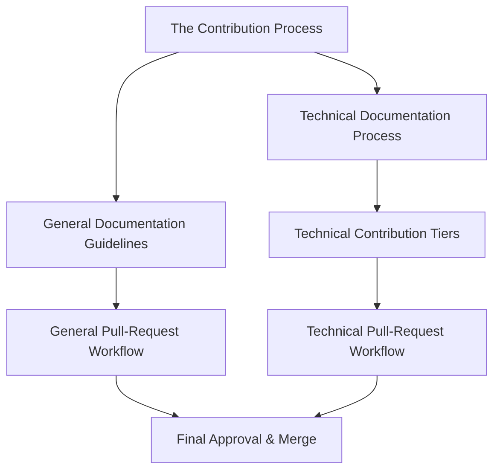
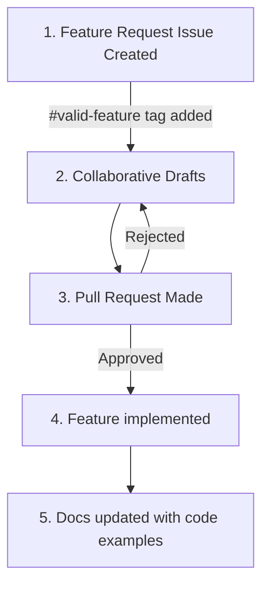

# The Contribution Process Overview
## Change Starts with Documentation
At EthicalMatch, every new idea begins with documentation. Why?
1. Documentation will *always* reflect the current state of the project
1. Clearly defined ideas make implementation smoother for developers
1. It gives autonomy to participants to learn and work at their own pace

## Use Issues to Propose Changes
All contributions start with an issue. This provides an avenue for conversation about your idea before any changes are made, and enables tracking of progress and prioritizing the interests of the community.  
The two issue templates you can open are:
- **[Documentation Change](https://github.com/Ethical-Commons-Project/EthicalMatch-docs/issues/new?assignees=&labels=enhancement&projects=&template=documentation-change.md&title=)**: For updates, clarifications, or new resources in the repository
- **[Feature Request](https://github.com/Ethical-Commons-Project/EthicalMatch-docs/issues/new?assignees=&labels=feature&projects=&template=feature_request.md&title=)**: For new functionality or significant changes requiring technical implementation

## Pull-Request Reviews and Approvals
Before merging changes, pull requests (PRs) undergo a review process to ensure quality, alignment with project goals, and adherence to our standards.
- **General Contributions** require approval from an authorized area expert ( #todo this concept needs expanding. How do I become an "area expert"? )
- **Technical Contributions** require approval from developers and peer reviewers

> [!Tip]
> If you're unfamiliar with how to make a pull request, our [first timers](#first-time-contributing-to-open-source) section will get you up to speed!

# Technical Documentation Process
## Documentation First?!
You may hear "documentation-first" and shudder, recalling the rigidity of [TDD](https://en.wikipedia.org/wiki/Test-driven_development) or the drudgery of post-implementation documentation. At EthicalMatch, we’ve designed our documentation process to be the opposite:  
- **It reduces your design workload.** By collaborating on plain-English documentation to start, we give you a roadmap without locking you into rigid definitions.
- **It simplifies post-implementation documentation.** Because the initial idea is already described, updating the documentation is reduced to translating code to English, or providing usage examples ( #todo which is a likely candidate for automation… )  

By structuring documentation this way, we aim to reduce cognitive load at every stage, allowing you to focus on building while still ensuring clarity for future contributors.

## Workflow for Technical Contributions
This is the general workflow for contributions to technical documentation:

## Breaking it down
#### 1. Feature Request Issue Creation:
Every new feature or significant change starts with a [Feature Request issue](https://github.com/Ethical-Commons-Project/EthicalMatch-docs/issues/new?assignees=&labels=feature&projects=&template=feature_request.md&title=).  
#### 2. Initial Documentation Draft:
Collaborate with contributors to create a high-level, plain-English overview of the feature. This will probably be done easiest in google docs but #todo there's no best-practice yet.
> [!Tip]
> Focus on behavior, not implementation  
> *Well-known design patterns are the exception* 
#### 3. Code Implementation and Documentation Updates
    - Begin coding based on the high-level documentation.
    - Update the document with details of the implementation, such as new classes or design patterns.
#### 2. Review and Approval
    - Submit a PR for both the code and updated documentation.
    - Documentation must be approved by at least two contributors with the **developer** tag.
#### 3. Finalization and Status Updates
    - After approval, the PR is merged, and the feature’s documentation is marked as complete.

This process ensures that documentation evolves with the codebase, providing a single source of truth without bogging down development.