Back to: [Guides](Guides.md)

## Overview
Good documentation is the backbone of any successful project, and with a non-profit open-source project like [EthicalMatch](ATLAS/EthicalMatch%20Docs/README.md), it's the only thing keeping all of our lovely contributors on the same page. As such, we take it *very* seriously.

Once you're familiar with the [[process]], you can create a copy of the [[documentation template]] and start getting your ideas out for everyone to follow along with. Here are things we're looking for when accepting new documentation:

## Hyperlinks Everywhere!
Rather than relying on a perfectly crafted and impossible to manage folder structure, this repository makes excessive use of hyperlinks to group related documents together.

By starting at a high-level overview document, and drilling down into the specifics of what one wants to know, readers can skip the bulk of irrelevant information, and find exactly the pieces of information that they're looking for, without getting lost in a folder structure of vague titles.

```mermaid
graph LR
CC[Core Concept] --🔗--> F1[Feature 1]
CC[Core Concept] --🔗--> F2[Feature 2]
F2--🔗-->F2I[What I'm looking for]
F1--🔗-->F1I[Stuff I don't care about]
```

Every document will have *child* documents that it links out to. To make sure your document is accessible, put a hyperlink in a *meaningful* location so future contributors can find it when they need it, and make full use of the new information!

Once you've got a link to your doc, add a link at the top *pointing back*, forming a two-way relationship for easy navigation.

### Don't be a perfectionist!
Nothing is ever complete the first time around, and this is a collaborative project! Don't be afraid to add links to pages that don't exist yet, or simply say "This needs some more thinking". That opens up a clear avenue for the community to get involved, have a conversation about what's uncertain, and come to a conclusion *together!*

> [!Warning]
> Don't forget to mark these unfinished sections with \#todo otherwise it could be a long time before they're updated, leaving new viewers confused or empty-handed

> [!Tip]
> GitHub doesn't support wikilinks, which makes this syntax particularly useful for marking "wishful" page links. To create a wishful-link, simply format the link text like this: \[\[File-Name|Display Text]]. Inside [[Obsidian Setup|Obsidian]] This also makes creating new pages as simple as clicking :)

## Visuals & Graphs
#todo Introduce and pitch Mermaid graphs as a preferable alternative to linked .pngs
#todo Link to useful syntaxes, and encourage using existing documentation as inspiration for formatting your own

## Style
#todo 
- Add a new line after each paragraph

> [!Tip]
> If you are using our [[Obsidian Setup]], this styling should be automatically handled, so you don't have to think about it.

# TL;DR:
- Use the [[documentation template]] for a quick start (and to adhere to best practices)
	- Add a backlink to the parent document (if any)
	- Wrap up with a TL;DR: section for busy-bees and speed readers
- Use hyperlinks as a means of expanding on a concept, *even if the file doesn't exist yet*
	- This is easily done in [[Obsidian Setup|Obsidian]] by typing "\[\[", and then the name of the file
- Use visuals to break up walls of text, and to make concepts easier to digest
	- Use [mermaid](https://jojozhuang.github.io/tutorial/mermaid-cheat-sheet/) code blocks (\`\`\`mermaid ... \`\`\`) for charts where applicable, and images as a last resort