# Documentation Guidelines
This document lays out the patterns you should use and the expectations you will be held to when adding to the EthicalMatch-Docs repository
## Overview
Good documentation is the backbone of any successful endeavor, and with a non-profit open-source project like EthicalMatch, it's the only thing keeping all of our lovely contributors on the same page. As such, we take it *very* seriously.

Once you're familiar with the [contribution process](CONTRIBUTING.md), you can create a copy of the [[documentation template]] and start getting your ideas out for everyone to follow along with. Here are things we're looking for when accepting new documentation:

## Hyperlinks Everywhere!
Rather than relying on a perfectly crafted and impossible to manage folder structure, this repository makes excessive use of hyperlinks to group related documents together.

By starting at a high-level overview document, and drilling down into the specifics of what one wants to know, readers can skip the bulk of irrelevant information, and find exactly the pieces of information that they're looking for, without getting lost in a folder structure of vague titles.

```mermaid
graph LR
CC[Core Concept] --🔗--> F1[Feature 1]
CC[Core Concept] --🔗--> F2[Feature 2]
F2--🔗-->F2I[What I'm looking for]
F1--🔗-->F1I[Stuff I don't care about]
```

### Don't Be a Perfectionist!
Nothing is ever complete the first time around, and this is a collaborative project! Don't be afraid to add links to pages that don't exist yet, or simply leave a \#todo note. That opens up a clear avenue for the community to get involved, have a conversation about what's uncertain, and come to a conclusion *together!*

> [!Warning]
> Don't forget to mark these unfinished sections with ( \#todo my note ) otherwise it could be a long time before they're updated, leaving new viewers confused or empty-handed  
> Example: "Give everyone a cookie ( \#todo I don't know how this should be handled )"

> [!Tip]
> GitHub doesn't support wikilinks, which is perfect for marking "wishful" page links for others to expand on later.  
> **Format**: \[\[File-Name|Optional Display Text]]  
> In [[Obsidian Setup|Obsidian]], this makes creating that "wishful" link as easy as clicking on it. :)  

## Visuals & Graphs
#todo Introduce and pitch Mermaid graphs as a preferable alternative to linked .pngs
#todo Link to useful syntaxes, and encourage using existing documentation as inspiration for formatting your own

## Style
##### Speech
- Write in the present tense. "The server uses X", not "The server will use X". 
	*Even if it's not yet true, it will be one day, and accidentally leaving in future-tense language will cause confusion*
##### Syntax
#todo 
- Add a new line after each paragraph

> [!Tip]
> If you are using our [[Obsidian Setup]], linting will take care of most of the nitpicky things

# TL;DR:
- Use the [[documentation template]] for a quick start (and to adhere to best practices) ( #todo create a documentation template )
	- Start the document with a one-sentence-overview. i.e. "This document {insert purpose here}"
	- Add a backlink to the parent document (if any)
	- Wrap up with a TL;DR: section for busy-bees and speed readers
- Use hyperlinks as a means of expanding on a concept
	- If you're not ready to expand on something yet, use a [wikilink or write a \#todo note](#dont-be-a-perfectionist)
- Use visuals to break up walls of text, and to make concepts easier to digest
	- Use callout blocks to draw attention to something important: `> [!{header text, like "Tip"}]`
	- Use [mermaid](https://jojozhuang.github.io/tutorial/mermaid-cheat-sheet/) code blocks (\`\`\`mermaid … \`\`\`) for charts where applicable, and images as a last resort