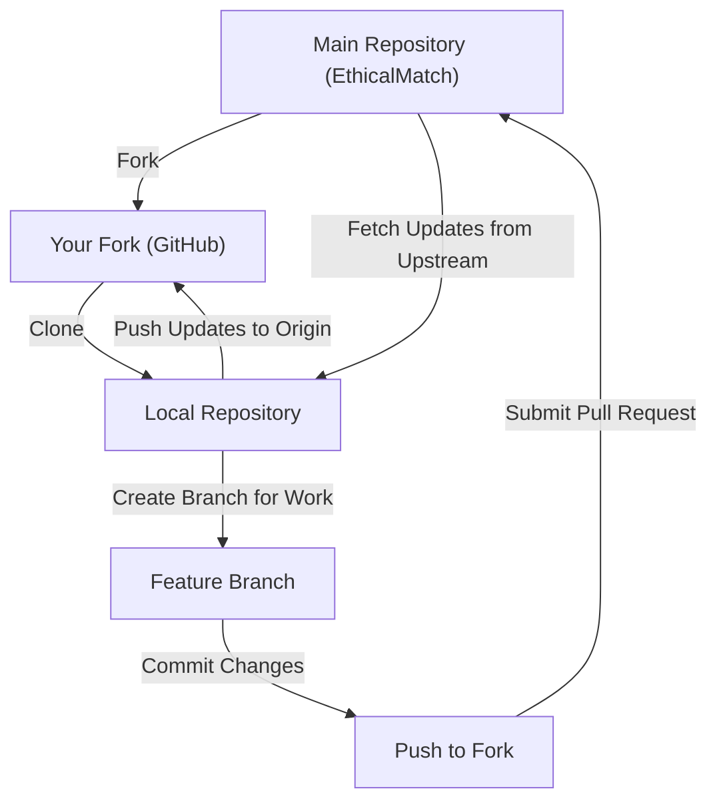

# Your First Pull Request
So, you want to make a contribution but don't know how. This simple step-by-step guide will take you from ground zero, all the way to making your first official contribution!

- [x] Fork docs repo
- [x] Optional: Setup GitHub Desktop
- [x] Clone forked repo locally
- [x] Link the forked repo with the upstream repo
- [x] Optional: Setup Obsidian
- [ ] Make a branch with the issue name
- [ ] Make and commit changes
- [ ] Fetch and merge updates from the upstream repo
- [ ] Make a pull request to the upstream repo

## Step 1: Fork the Docs Repository
For security reasons, you will be working on your own copy of the EthicalMatch documentation, and proposing your changes to the official repository via pull requests (PRs). We'll get to that later.
1. Simply click the "Fork" button as shown below, and a copy will get added to your GitHub account

> [!Note]
> You will need to have a GitHub account for this to work. Clicking "Fork" will prompt you to create an account if you don't already have one
## Step 2: Pull the Docs to Your Computer
You can't make contributions if you don't have the source to work on!
First, you need to pull what's hosted by GitHub onto your local machine. We recommend using GitHub desktop, but there are plenty of guides online if you'd rather use the Command Line Interface.
1. [Install GitHub Desktop](https://desktop.github.com/download/) and open it
1. Click File > Options > Accounts > Sign in to GitHub.com, and follow the sign in process
1. Click File > Clone Repository > GitHub.com (default tab)
1. Under "Your repositories", select the EthicalMatch fork that you created
	- When asked "**How are you planning to use this fork?**", select "**To contribute to the parent project**", then hit continue. This will make the rest of the process easier.  

The documentation should now be downloaded to your local machine at the file path you specified!

> [!Tip]
	> If you don't see your fork in the GitHub.com tab, you can clone a repo using a URL instead. You can find the link to clone your repository on github.com below: 
> 
	> You can also "Open with GitHub Desktop" as seen at the bottom of this image
## Create or Switch to an Existing Branch
When you first clone a repository, you'll be on the "main" branch. This is the **official** branch that everyone refers to.
Branches are separate "workspaces" where you can make your changes without affecting the main repository. This ensures your contributions can be reviewed safely in a pull request, before becoming an official part of the project.
1. In **GitHub Desktop**, click **Current Branch** in the top center.
1. Either select an existing branch, or create a new one by
    - clicking **New Branch**, giving it a name, and clicking "create branch"
    - If your work is related to an issue, name your branch to reflect it (e.g., `#17-pull-request-guide`)

> [!Warning]  
> If you're looking to address a GitHub issue, someone else might be working on it already. Make sure to check the comments and the "Assignees" section on the right sidebar so your time isn't wasted! (You might try reaching out them in our [Discord](https://discord.gg/P7qfVuqMXz) to see if they'd like a hand)

## Optional: Install Obsidian for Documentation Editing
Obsidian is a text editor designed for linking knowledge and has extensive plugin support. It is the editor of choice for the EthicalMatch project.
1. [Download Obsidian](https://obsidian.md/download) and open it
1. Click "Open Folder as Vault", and select the directory you cloned your fork into
1. Click "Trust author and enable plugins"
> [!Note]
> These plugins are all quality of life plugins, and choosing to use Obsidian without them won't prevent you from contributing
## Make a Branch
Think of branches like workspaces. Each branch allows you to work on changes in isolation, without affecting any other branches.  
If you're addressing a GitHub Issue, it's a good idea to start your branch name with the number of the 
## Make and Commit Changes
With your branch ready, you can now make changes!
1. Open the files you want to edit in Obsidian or your preferred text editor.
1. Save your changes.
1. In **GitHub Desktop**, navigate to the **Changes** tab.
1. Review your changes to ensure they are correct.
1. Write a summary of your work (e.g., "Fixed typos in CONTRIBUTING.md").
1. Click **Commit to [branch name]** to save your changes locally.

> [!Tip]  
> Committing doesn't automatically upload your changes to GitHub. You'll do that in the next step.
    

## Submit a Pull Request

Now it's time to propose your changes to the project!

1. In **GitHub Desktop**, click **Push Origin** to upload your changes to GitHub.
    
1. Go to the EthicalMatch repository on GitHub in your browser.
    
1. Click the **Pull Requests** tab, then **New Pull Request**.
    
1. Select your branch from the dropdown menu, and compare it to the main branch.
    
1. Follow the prompts to submit your pull request with a brief description of your changes.
    
> [!Tip]  
> Be clear and concise in your pull request description so reviewers understand your contribution.
    

---

Congratulations! 🎉 You've officially submitted your first pull request. The EthicalMatch team will review your changes and get back to you soon.

